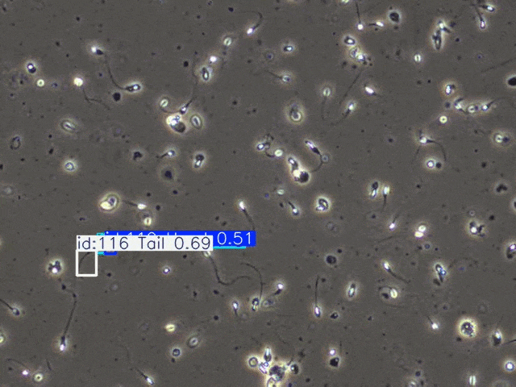
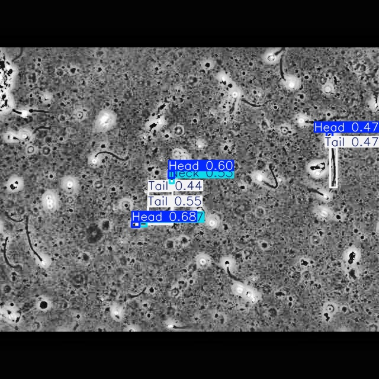
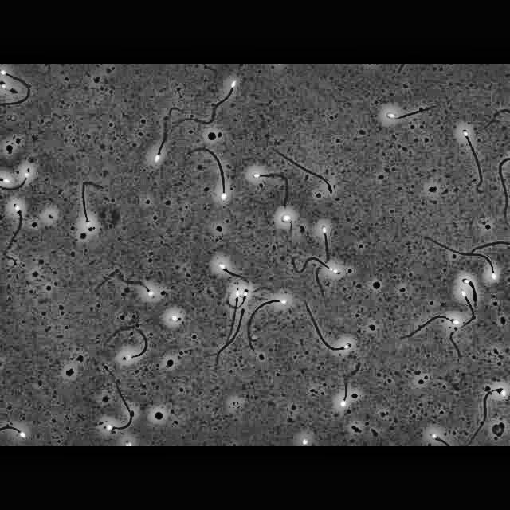
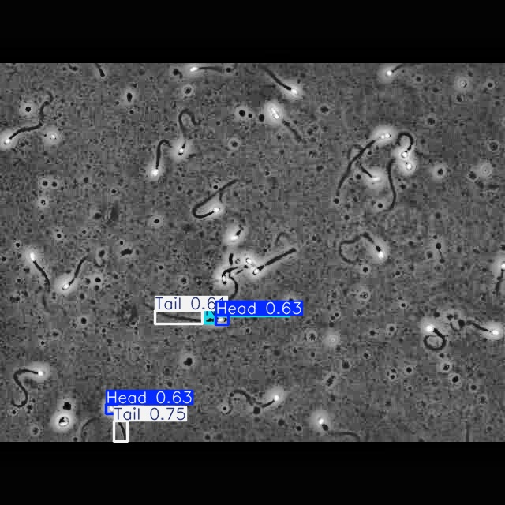

# 🧬 Sperm Motility & Morphology Assessment using Deep Learning

[](https://www.python.org/)
[]()
[]()
[]()

---

## 🎯 Overview

An **AI-powered computer vision system** that analyzes sperm microscopy videos to evaluate:

- 🧠 **Morphology** (Head, Neck, Tail structure)
- 🚀 **Motility** (Movement trajectory & velocity)
- ✅ **Final Classification** (Normal vs Abnormal sperm)

This system automates traditional microscopic analysis, making it **faster, consistent, and scalable** for fertility research.

---

## 🎥 Demo


---

## 🔬 Problem Statement

Manual sperm analysis is:

* ⏱️ Time-consuming (10–20 minutes per sample)
* 🎯 Subjective (depends on technician expertise)
* ⚠️ Prone to human error
* 📉 Difficult to scale for large datasets

### 💡 Solution

This project builds an **end-to-end AI pipeline** that:

* Detects sperm components
* Tracks movement across frames
* Evaluates morphology and motility
* Generates annotated output videos automatically

---

## 🧠 Key Features

* 🔍 **Sperm Detection** using YOLOv8
* 🎯 **Multi-object Tracking** using ByteTrack
* 📏 **Morphology Analysis** (WHO-inspired ratios)
* 📈 **Motility Classification** (trajectory-based)
* 🎥 **Annotated Output Video**
* ⚡ Fully automated pipeline

---

## 🏗️ System Architecture

```
Input Video
    ↓
Frame Extraction
    ↓
YOLOv8 Detection
    ↓
Object Tracking (ByteTrack)
    ↓
Morphology Analysis
    ↓
Motility Analysis
    ↓
Final Classification
    ↓
Annotated Output Video
```

---

## 📊 Results

| Metric                      | Value |
| --------------------------- | ----- |
| **mAP50**                   | ~0.52 |
| **mAP50-95**                | ~0.27 |
| **Classification Accuracy** | ~80%  |
| **Tracking Success Rate**   | ~80%  |

### ✅ Key Observations

* Successfully detects sperm components in microscopy frames
* Tracks sperm movement across video sequences
* Classifies sperm based on motion + morphology
* Works reliably on real microscopy video data

---

## 📸 Output Preview





---

## 🛠️ Technologies Used

### Core Technologies

* **Python**
* **YOLOv8 (Ultralytics)**
* **PyTorch**

### Libraries

* OpenCV
* NumPy
* Pandas
* Matplotlib

### Tracking

* ByteTrack (multi-object tracking)

### Tools

* Roboflow (annotation)
* VS Code (development)

---

## 📂 Dataset

* 📹 Total videos: 85
* 🖼️ Frames extracted: ~1600
* 🏷️ Annotated images: ~1000
* 📦 Classes:

  * Head
  * Neck
  * Tail

### Preprocessing

* Frame extraction from videos
* Annotation in YOLO format
* Data cleaning & splitting (70/20/10)
* Basic augmentation (flip, brightness, crop)

---

## 🚀 Installation

```bash
git clone https://github.com/YOUR_USERNAME/sperm-motility-analysis.git
cd sperm-motility-analysis

pip install -r requirements.txt
```

---

## 💻 Usage

```bash
python main.py sample_input/sample_video.mp4
```

---

## 📊 Motility Analysis

Motility is calculated using **trajectory-based motion analysis**:

* Total distance traveled
* Straight-line displacement
* Straightness ratio:

```
straightness = straight_distance / total_distance
```

### Classification

| Condition | Type            |
| --------- | --------------- |
| > 0.7     | Progressive     |
| 0.3–0.7   | Non-progressive |
| < 0.3     | Immotile        |

---

## ⚠️ Important Notes

* Dataset and model weights (`.pt`) are not included due to size constraints
* You can train your own model using YOLOv8

---

## 🔮 Future Improvements

* Segmentation-based morphology analysis
* Improved detection for fast-moving sperms
* Web app deployment (Streamlit / Flask)
* Real-time sperm analysis system

---

## 💡 Impact

* ⏱️ Reduces analysis time from **15 min → ~2 min**
* 🎯 Provides consistent and objective evaluation
* 📈 Scalable for large datasets
* 🧪 Useful for fertility research and diagnostics

---

## 👨‍💻 Author

**Puneeth Gowda Y S**

* 🎓 B.E. Information Science
* 💼 Aspiring Data Scientist / ML Engineer
* 🔗 [LinkedIn](https://www.linkedin.com/in/puneethgowdays/)
* 💻 [GitHub](https://github.com/puneethgowdays)

---

## ⭐ Support

If you found this project useful, please give it a ⭐

---

<div align="center">

**Built with ❤️ using AI & Computer Vision**

</div>
```
